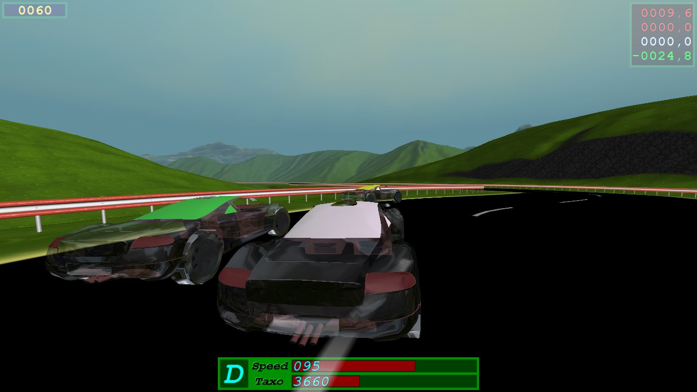

# Proyectos en Visual Basic 6

Este conjunto de proyectos incluye aplicaciones desarrolladas en Visual Basic 6 (VB6), algunas de creación original y otras modificadas a partir de soluciones preexistentes. Las modificaciones realizadas optimizan funcionalidades, mejoran la interfaz de usuario y adaptan el código a necesidades específicas.

